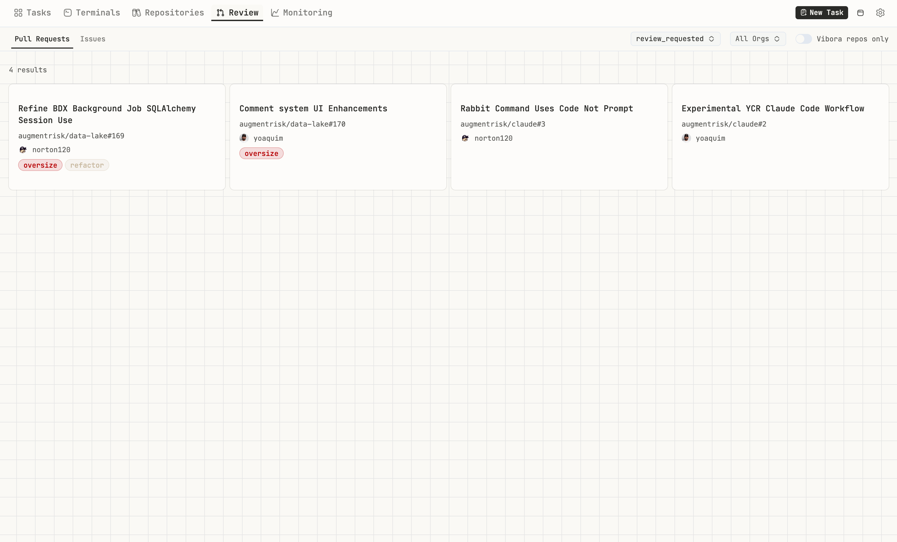

# Vibora

The Vibe Engineer's Cockpit. Orchestrate Claude Code across parallel workstreams from a terminal-first command center.


## What It Does

**Vibora is for developers who take Claude Code seriously.** Not as a novelty, but as their primary interface for getting things done. If you live in the terminal and want to run multiple Claude Code sessions across isolated workstreams, Vibora is your cockpit.

- **Task Terminals View** — See and control all your Claude Code sessions across every worktree in one parallel view. The killer feature for orchestrating multiple agents simultaneously.
- **Run Local or Remote** — Client/server architecture lets you run agents on your machine or a remote server. Launch tasks, close your laptop, and your agents keep working.
- **Git Worktree Isolation** — Each task runs in its own worktree. Your main branch stays clean until you're ready to merge.
- **Deep Claude Integration** — Plugin for automatic status sync and slash commands. MCP server lets Claude manage tasks, list repositories, and send notifications directly.
- **Persistent Terminals** — Named terminal tabs that survive restarts for ongoing work that doesn't fit into task worktrees.

## Key Features

- **Parallel Agent Orchestration** — Run multiple Claude Code sessions across different tasks and worktrees
- **Local or Remote Execution** — Run on your machine or a remote server; agents continue working when you disconnect
- **Git Worktree Isolation** — Safe experimentation without touching your main branch
- **Claude Code Plugin** — Automatic status sync, slash commands, session continuity
- **MCP Server** — Let Claude manage tasks, list repositories, and send notifications
- **Kanban Task Management** — Visual task tracking from planning to done
- **PR Monitoring** — Track pull requests across repositories
- **Linear Integration** — Sync task status with Linear tickets
- **System Monitoring** — CPU, memory, and disk usage at a glance
- **Cross-Platform** — Desktop app (Mac, Linux) or web application

## Quick Start

Requires [Bun](https://bun.sh/) and [Claude Code](https://claude.ai/code).

### Desktop App (Recommended)

Download the latest release:

| Platform | Download |
|----------|----------|
| **macOS** (Apple Silicon) | [Download DMG](https://vibora-utils.knowsuchagency.workers.dev/download/dmg) |
| **Linux** | [Download AppImage](https://vibora-utils.knowsuchagency.workers.dev/download/appimage) |

The desktop app bundles everything—just install and run. It will start the server, install the Claude Code plugin, and check for updates automatically.

> **macOS note**: On first launch, right-click the app and select "Open" to bypass Gatekeeper.

### Web Application

Run Vibora as a web server for browser access or remote deployment.

```bash
# Install and start with curl
curl -fsSL https://raw.githubusercontent.com/knowsuchagency/vibora/main/install.sh | bash

# Or install via npm
npx vibora@latest up
```

If using npm, install the Claude Code plugin separately:

```bash
claude plugin marketplace add knowsuchagency/vibora
claude plugin install vibora@vibora --scope user
```

Open http://localhost:7777 in your browser.

## Features

### Task Terminals View

The killer feature. See all your Claude Code sessions across every task and worktree in a single parallel view. Each task runs in an isolated git worktree, and you can monitor and interact with all of them simultaneously.


### Kanban Board

Track tasks from planning to done. Create tasks that automatically spin up isolated git worktrees, and watch their status update in real-time as you work with Claude Code.


### Repositories

Manage your projects with quick actions. Create new tasks, open terminals, and configure repository settings from one place.


### PR Review

Monitor pull requests across all your repositories. Filter by status, organization, and more.



### System Monitoring

Keep an eye on system resources while your agents work. CPU, memory, and disk usage at a glance.


## Claude Code Plugin

The Vibora plugin for Claude Code enables seamless integration:

- **Automatic Status Sync** — Task moves to "In Review" when Claude stops, "In Progress" when you respond
- **Slash Commands** — `/review`, `/pr`, `/notify`, `/linear`, `/task-info`
- **Session Continuity** — Claude sessions are tied to task IDs
- **MCP Server** — Task management tools available directly to Claude

The plugin is automatically installed in task worktrees when tasks are created. To install globally:

```bash
claude plugin marketplace add knowsuchagency/vibora
claude plugin install vibora@vibora --scope user
```

### MCP Tools

The plugin includes an MCP server that exposes task management tools:

- `list_tasks` — List all tasks with optional status/repo filter
- `get_task` — Get task details by ID
- `create_task` — Create a new task with git worktree
- `update_task` — Update task title/description
- `delete_task` — Delete a task
- `move_task` — Change task status
- `list_repositories` — List configured repositories
- `send_notification` — Send notification to enabled channels

For Claude Desktop, add to your `claude_desktop_config.json`:

```json
{
  "mcpServers": {
    "vibora": {
      "command": "vibora",
      "args": ["mcp"]
    }
  }
}
```

## Remote Server Setup

Run the backend on a remote server and connect from anywhere. Launch tasks, close your laptop, and your agents keep working. As AI becomes more capable of autonomous work, this becomes essential.

1. **On the remote server:**
   ```bash
   npx vibora@latest up
   vibora config set remoteHost your-server.example.com
   vibora config set basicAuthUsername admin
   vibora config set basicAuthPassword your-secure-password
   ```

2. **Connect from desktop app** — Click "Connect to Remote" and enter the server URL

3. **Or access via browser** — Open `http://your-server.example.com:7777`

<details>
<summary><strong>Configuration</strong></summary>

Settings are stored in `.vibora/settings.json`. The vibora directory is resolved in this order:

1. `VIBORA_DIR` environment variable (explicit override)
2. `.vibora` in current working directory (per-worktree isolation)
3. `~/.vibora` (default)

| Setting | Env Var | Default |
|---------|---------|---------|
| port | `PORT` | 7777 |
| defaultGitReposDir | `VIBORA_GIT_REPOS_DIR` | ~ |
| remoteHost | `VIBORA_REMOTE_HOST` | (empty) |
| sshPort | `VIBORA_SSH_PORT` | 22 |
| basicAuthUsername | `VIBORA_BASIC_AUTH_USERNAME` | null |
| basicAuthPassword | `VIBORA_BASIC_AUTH_PASSWORD` | null |
| linearApiKey | `LINEAR_API_KEY` | null |
| githubPat | `GITHUB_PAT` | null |
| language | — | null (auto-detect) |

Notification settings (sound, Slack, Discord, Pushover) are configured via the Settings UI or CLI.

Precedence: environment variable → settings.json → default

### Linear Integration

Vibora can sync task status with Linear tickets. Configure `linearApiKey` in settings or set `LINEAR_API_KEY`. When a task is linked to a Linear ticket, status changes in Vibora automatically update Linear.

### Basic Auth

Set `basicAuthUsername` and `basicAuthPassword` to require authentication when exposing Vibora over a network.

</details>

<details>
<summary><strong>CLI Reference</strong></summary>

The CLI lets AI agents working inside task worktrees query and update task status.

### Server Management

```bash
vibora up                        # Start server daemon
vibora down                      # Stop server
vibora status                    # Check server status
vibora health                    # Check server health
vibora mcp                       # Start MCP server (stdio)
```

### Current Task (auto-detected from worktree)

```bash
vibora current-task              # Get current task info
vibora current-task in-progress  # Mark as IN_PROGRESS
vibora current-task review       # Mark as IN_REVIEW
vibora current-task done         # Mark as DONE
vibora current-task cancel       # Mark as CANCELED
vibora current-task pr <url>     # Associate a PR with current task
vibora current-task linear <url> # Link to a Linear ticket
```

### Task Management

```bash
vibora tasks list                # List all tasks
vibora tasks get <id>            # Get task by ID
vibora tasks create              # Create a new task
vibora tasks update <id>         # Update a task
vibora tasks move <id>           # Move task to different status
vibora tasks delete <id>         # Delete a task
```

### Git Operations

```bash
vibora git status                # Git status for current worktree
vibora git diff                  # Git diff for current worktree
vibora git branches              # List branches in a repo
```

### Worktrees

```bash
vibora worktrees list            # List all worktrees
vibora worktrees delete          # Delete a worktree
```

### Configuration

```bash
vibora config get <key>          # Get a config value
vibora config set <key> <value>  # Set a config value
```

### Notifications

```bash
vibora notifications             # Show notification settings
vibora notifications enable      # Enable notifications
vibora notifications disable     # Disable notifications
vibora notifications test <ch>   # Test a channel
vibora notify <title> [message]  # Send a notification
```

### Global Options

```bash
--port=<port>     # Server port (default: 7777)
--url=<url>       # Override full server URL
--pretty          # Pretty-print JSON output
```

</details>

## Internationalization

Available in English and Chinese. Set the `language` setting or let it auto-detect from your browser.

## Development

See [DEVELOPMENT.md](DEVELOPMENT.md) for development setup, architecture, and contributing guidelines.

## License

[PolyForm Shield 1.0.0](LICENSE)

**In plain English:** You can use Vibora for any purpose—personal or commercial. KNOWSUCHAGENCY CORP has no claim over the software you build using Vibora. What's prohibited is reselling or redistributing Vibora itself for profit. The software is provided as-is with no warranty.
