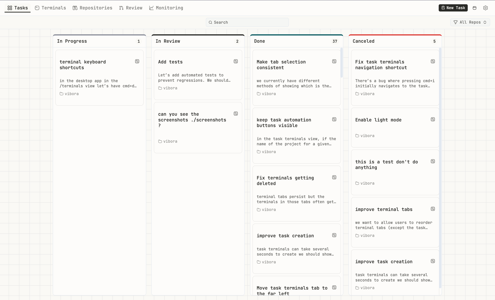
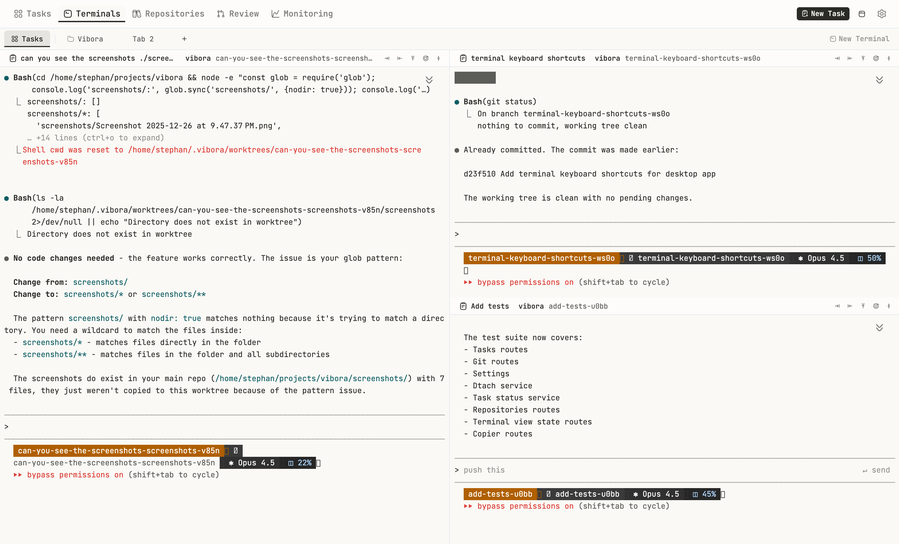
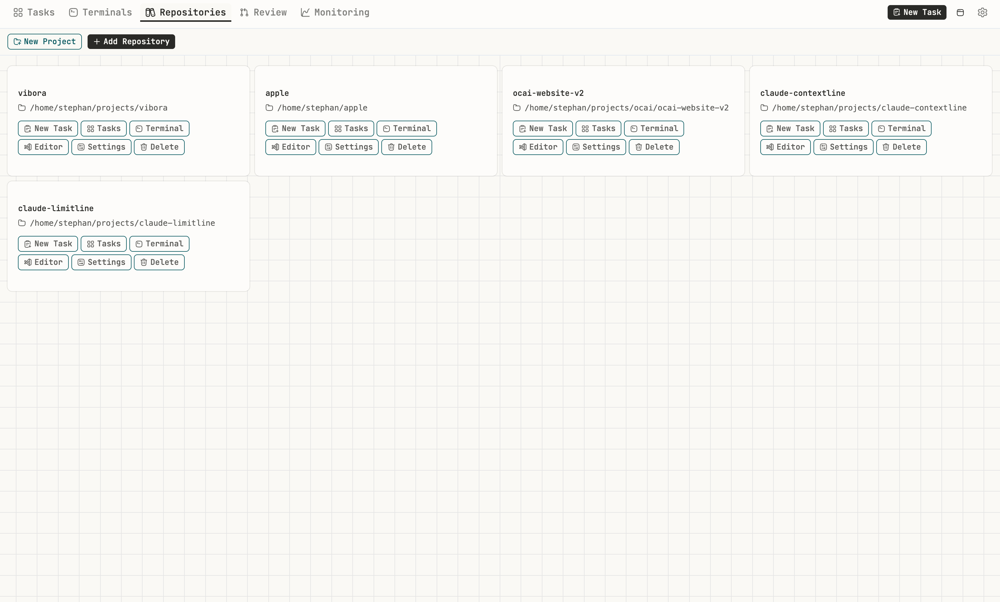
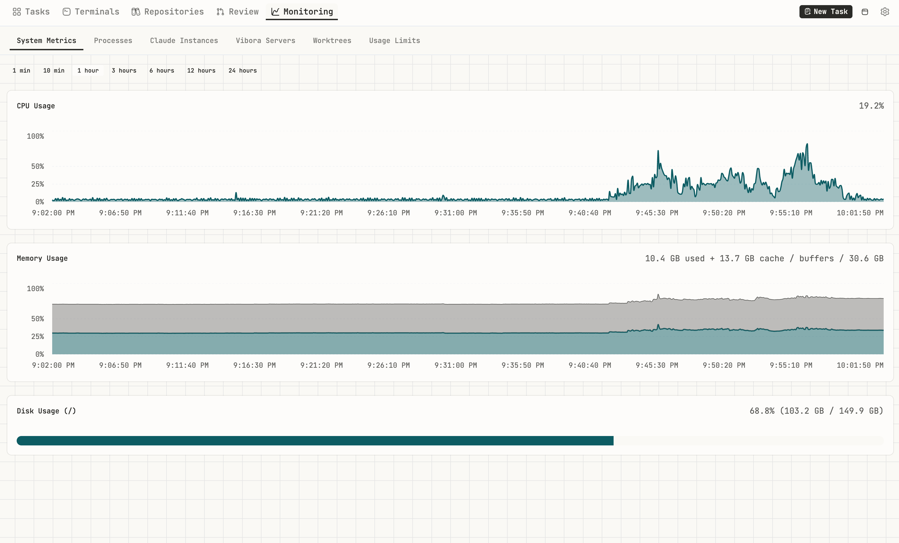

# Vibora

**Harness Attention. Orchestrate Agents. Ship.**



## What It Does

Run multiple AI coding agent sessions in parallel across isolated git worktrees. Monitor them all from one screen. Close your laptop—they keep working. Deploy to production when ready. Self-hosted and open source.

Vibora supports **Claude Code** and **OpenCode** with per-repository and per-task agent selection.

- **Full Development Lifecycle** — Develop features in isolated git worktrees, then deploy to production with Docker Compose. No context switching, no vendor lock-in.
- **Parallel Agent Orchestration** — Run multiple AI agent sessions across different tasks and worktrees. See and control all sessions in one parallel view.
- **Work From Anywhere** — Close your laptop—your agents keep working on your behalf. Pick up where you left off from your phone.
- **Multi-Agent Support** — Choose between Claude Code and OpenCode. Set a global default, override per-repository, or select per-task.
- **Open Source & Self-Hosted** — Inspect the code, run it anywhere, own your data. From a $5 VPS to your home lab.

## Key Features

- **App Deployment** — Deploy with Docker Compose, automatic Traefik routing, optional Cloudflare DNS integration
- **Parallel Agent Orchestration** — Run multiple AI coding agent sessions across different tasks and worktrees
- **Multi-Agent Support** — Use Claude Code or OpenCode, configurable globally, per-repo, or per-task
- **Work From Anywhere** — Run on a remote server; agents continue working when you disconnect
- **Git Worktree Isolation** — Safe experimentation without touching your main branch
- **Claude Code Plugin** — Skill for task management, automatic status sync, session continuity
- **MCP Server** — Let Claude manage tasks, list repositories, and send notifications
- **Kanban Task Management** — Visual task tracking from planning to done
- **PR Monitoring** — Track pull requests across repositories
- **Linear Integration** — Sync task status with Linear tickets
- **Cross-Platform** — Desktop app (Mac, Linux) or web application

## Quick Start

```bash
npx vibora@latest up
```

That's it! Vibora will:
- Check for required dependencies (bun, dtach, AI agent CLI, uv)
- Offer to install any that are missing
- Start the server on http://localhost:7777
- Show getting started tips

Open http://localhost:7777 in your browser.

### Check Your Setup

```bash
vibora doctor
```

Shows the status of all dependencies with versions.

### Desktop App

Download the desktop app for a bundled experience:

| Platform | Download |
|----------|----------|
| **macOS** (Apple Silicon) | [Download DMG](https://github.com/knowsuchagency/vibora/releases/latest/download/Vibora-macos-arm64.dmg) |
| **Linux** | [Download AppImage](https://github.com/knowsuchagency/vibora/releases/latest/download/Vibora-linux-x64.AppImage) |

The desktop app bundles everything—just install and run. It will start the server, install the Claude Code plugin, and check for updates automatically.

<details>
<summary>macOS Installation Notes</summary>

1. Open the DMG and drag Vibora to Applications
2. On first launch, macOS will block the app
3. Open **System Settings → Privacy & Security**, scroll down, and click **Open Anyway**
4. Confirm by clicking **Open Anyway** in the dialog

</details>

### Install Script (Recommended for Remote Servers)

For remote servers or VPS, use the install script—it auto-installs all dependencies:

```bash
curl -fsSL https://raw.githubusercontent.com/knowsuchagency/vibora/main/install.sh | bash
```

This installs bun, dtach, uv, Claude Code, OpenCode, GitHub CLI, Docker, cloudflared, and the vibora CLI + Claude Code plugin.

### Claude Code Plugin

Install the plugin for automatic status sync and task management:

```bash
claude plugin marketplace add knowsuchagency/vibora
claude plugin install vibora@vibora --scope user
```

## Features

### Kanban Board

Track tasks from planning to done. Create tasks that automatically spin up isolated git worktrees, and watch their status update in real-time as you work with your AI agents.


### Task Terminals View

See all your AI agent sessions across every task and worktree in a single parallel view. Each task runs in an isolated git worktree, and you can monitor and interact with all of them simultaneously.



### App Deployment

Deploy applications directly from Vibora with Docker Compose. Edit compose files inline, configure environment variables, and manage services with automatic Traefik routing and optional Cloudflare DNS integration.


### Repositories

Manage your projects with quick actions. Create new tasks, open terminals, and configure repository settings from one place.



### Browser Preview

Preview your app alongside the agent terminal in a split-pane view. Watch changes in real-time as your AI agent iterates on your code.


### System Monitoring

Keep an eye on system resources while your agents work. CPU, memory, and disk usage at a glance.



## Supported Agents

Vibora supports multiple AI coding agents:

| Agent | Description |
|-------|-------------|
| **Claude Code** | Anthropic's CLI coding agent with deep MCP integration |
| **OpenCode** | Open-source coding agent with GPT-4 and other model support |

Configure your default agent globally in settings, override per-repository, or select per-task when creating new tasks.

## Claude Code Plugin

The Vibora plugin for Claude Code enables seamless integration:

- **Automatic Status Sync** — Task moves to "In Review" when Claude stops, "In Progress" when you respond
- **Vibora Skill** — CLI documentation for task management (see `plugins/vibora/skills/`)
- **Slash Commands** — `/review`, `/pr`, `/notify`, `/linear`, `/task-info`
- **Session Continuity** — Claude sessions are tied to task IDs
- **MCP Server** — Task management tools available directly to Claude

The plugin is automatically installed when Vibora starts. To install manually:

```bash
claude plugin marketplace add knowsuchagency/vibora
claude plugin install vibora@vibora --scope user
```

### MCP Tools

The plugin includes an MCP server that exposes task management and remote execution tools:

**Task Management:**
- `list_tasks` — List all tasks with optional status/repo filter
- `get_task` — Get task details by ID
- `create_task` — Create a new task with git worktree
- `update_task` — Update task title/description
- `delete_task` — Delete a task
- `move_task` — Change task status
- `list_repositories` — List configured repositories
- `send_notification` — Send notification to enabled channels

**Remote Command Execution:**
- `execute_command` — Execute shell commands on the Vibora server with persistent session support
- `list_exec_sessions` — List active command execution sessions
- `update_exec_session` — Rename a session
- `destroy_exec_session` — Clean up a session

The `execute_command` tool supports persistent sessions where environment variables, working directory, and shell state are preserved between commands. Sessions can be given optional names for identification and persist until manually destroyed.

For Claude Desktop, add to your `claude_desktop_config.json`:

```json
{
  "mcpServers": {
    "vibora": {
      "command": "vibora",
      "args": ["mcp"]
    }
  }
}
```

## Remote Server Setup

Run the backend on a remote server and connect from anywhere. Launch tasks, close your laptop, and your agents keep working. As AI becomes more capable of autonomous work, this becomes essential.

### Desktop App: SSH Port Forwarding (Recommended)

The desktop app connects to `localhost:7777`. Use SSH port forwarding to tunnel to your remote server:

```bash
# Forward local port 7777 to remote server's port 7777
ssh -L 7777:localhost:7777 your-server

# Or run in background with keep-alive
ssh -fN -o ServerAliveInterval=30 -o ServerAliveCountMax=3 -L 7777:localhost:7777 your-server
```

On the remote server, start Vibora:
```bash
npx vibora@latest up
```

The desktop app will connect through the tunnel automatically. This approach is:
- **Secure** — Backend stays bound to localhost, no exposed ports
- **Performant** — Direct SSH connection, lower latency than overlay networks
- **Simple** — No additional configuration needed

For persistent tunnels on macOS, use a launchd agent. See [this guide](https://gist.github.com/knowsuchagency/60656087903cd56d3a9b5d1d5c803186).

### Browser: Tailscale or Cloudflare Tunnels

For browser-only access, you can use Tailscale or Cloudflare Tunnels to expose your server:

1. **On the remote server:**
   ```bash
   npx vibora@latest up
   ```

2. **Access via browser** — Open the tunnel URL (e.g., `http://your-server.tailnet.ts.net:7777`)

<details>
<summary><strong>Configuration</strong></summary>

Settings are stored in `.vibora/settings.json`. The vibora directory is resolved in this order:

1. `VIBORA_DIR` environment variable (explicit override)
2. `.vibora` in current working directory (per-worktree isolation)
3. `~/.vibora` (default)

| Setting | Env Var | Default |
|---------|---------|---------|
| server.port | `PORT` | 7777 |
| paths.defaultGitReposDir | `VIBORA_GIT_REPOS_DIR` | ~ |
| editor.sshPort | `VIBORA_SSH_PORT` | 22 |
| integrations.linearApiKey | `LINEAR_API_KEY` | null |
| integrations.githubPat | `GITHUB_PAT` | null |
| appearance.language | — | null (auto-detect) |

Notification settings (sound, Slack, Discord, Pushover) are configured via the Settings UI or CLI.

Precedence: environment variable → settings.json → default

### Linear Integration

Vibora can sync task status with Linear tickets. Configure `linearApiKey` in settings or set `LINEAR_API_KEY`. When a task is linked to a Linear ticket, status changes in Vibora automatically update Linear.

</details>

<details>
<summary><strong>CLI Reference</strong></summary>

The CLI lets AI agents working inside task worktrees query and update task status.

### Server Management

```bash
vibora up                        # Start server daemon
vibora up -y                     # Start with auto-install (no prompts)
vibora down                      # Stop server
vibora status                    # Check server status
vibora doctor                    # Check all dependencies
vibora health                    # Check server health
vibora mcp                       # Start MCP server (stdio)
```

### Current Task (auto-detected from worktree)

```bash
vibora current-task              # Get current task info
vibora current-task in-progress  # Mark as IN_PROGRESS
vibora current-task review       # Mark as IN_REVIEW
vibora current-task done         # Mark as DONE
vibora current-task cancel       # Mark as CANCELED
vibora current-task pr <url>     # Associate a PR with current task
vibora current-task linear <url> # Link to a Linear ticket
```

### Task Management

```bash
vibora tasks list                # List all tasks
vibora tasks get <id>            # Get task by ID
vibora tasks create              # Create a new task
vibora tasks update <id>         # Update a task
vibora tasks move <id>           # Move task to different status
vibora tasks delete <id>         # Delete a task
```

### Git Operations

```bash
vibora git status                # Git status for current worktree
vibora git diff                  # Git diff for current worktree
vibora git branches              # List branches in a repo
```

### Worktrees

```bash
vibora worktrees list            # List all worktrees
vibora worktrees delete          # Delete a worktree
```

### Configuration

```bash
vibora config get <key>          # Get a config value
vibora config set <key> <value>  # Set a config value
```

### Notifications

```bash
vibora notifications             # Show notification settings
vibora notifications enable      # Enable notifications
vibora notifications disable     # Disable notifications
vibora notifications test <ch>   # Test a channel
vibora notify <title> [message]  # Send a notification
```

### Global Options

```bash
--port=<port>     # Server port (default: 7777)
--url=<url>       # Override full server URL
--pretty          # Pretty-print JSON output
```

</details>

## Internationalization

Available in English and Chinese. Set the `language` setting or let it auto-detect from your browser.

## Development

See [DEVELOPMENT.md](DEVELOPMENT.md) for development setup, architecture, and contributing guidelines.

## License

[PolyForm Shield 1.0.0](LICENSE)

**In plain English:**

- ✅ Use Vibora for any purpose—personal or commercial
- ✅ Build and sell software using Vibora (we have no claim over your work)
- ❌ Resell or redistribute Vibora itself for profit
- ⚠️ The software is provided as-is
